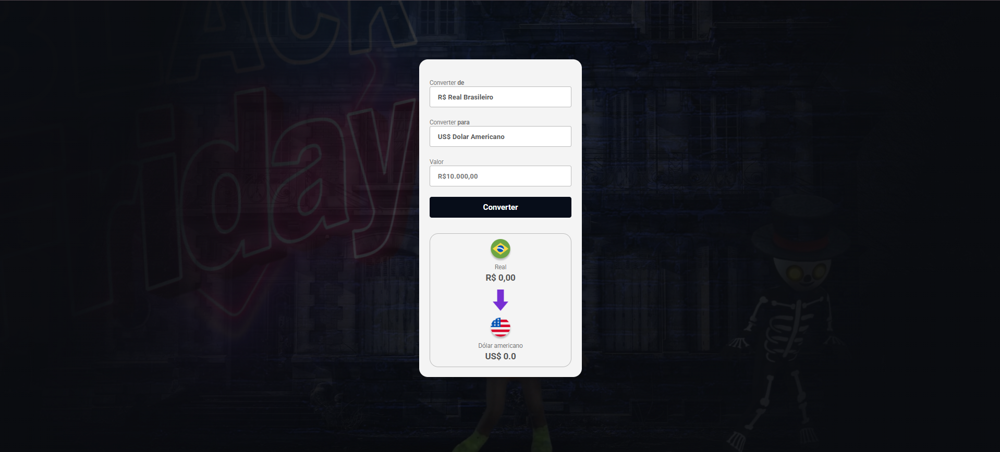

# Meu Projeto
 
 
 

## Conversor de Moeda

## ✨ Características

- ✅ Conversão em tempo real entre múltiplas moedas
- ✅ Interface limpa e responsiva
- ✅ Suporte para as principais moedas mundiais
- ✅ Sem dependências externas
- ✅ Atualização automática de taxas de câmbio

  ## 🚀 Tecnologias Utilizadas

- **HTML5** - Estrutura semântica
- **CSS3** - Estilização e responsividade
- **JavaScript** - Lógica da aplicação
